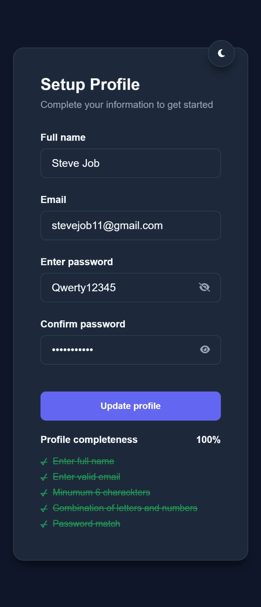

# 📝 Accessible Profile Setup Form

A responsive, accessible, and interactive profile setup form built with vanilla HTML, CSS, and JavaScript. This project focuses on Web Accessibility Guidelines (WCAG), real-time validation logic, and modern UI design with Dark Mode support.


<p align="center">
  <b>🖼️ PREVIEW</b><br>
  
</p>

<p align="center">
  <b>🖼️ EXAMPLE</b><br>
  
</p>

## 🚀 Features

### 🎨 UI/UX Design
- **Modern Aesthetic:** Clean interface using a Slate/Zinc color palette.
- **Dark/Light Mode:** Theme toggle with persistent state logic (CSS Variables).
- **Responsive:** Fully responsive layout that adapts to different screen sizes.
- **Custom Progress Bar:** Dynamic visual indicator of form completeness.

### ⚙️ Functionality
- **Real-time Validation:** Instant feedback as the user types.
- **Regex Logic:** Enforces secure passwords (letters + numbers combination).
- **Password Visibility:** Toggle button to show/hide password text.
- **Dynamic Checklist:** Visual requirements list that updates automatically (Pending/Completed).

### ♿ Accessibility (A11y) Focus
This project was built with a "semantics-first" approach:
- **Keyboard Navigation:** Full support for `Tab` navigation and focus states.
- **ARIA Attributes:** Used `aria-label`, `aria-controls`, and `aria-live` for screen readers.
- **Semantic HTML:** Proper use of `<label>`, `<input>`, and `<button>` elements.
- **Focus Indicators:** clear focus rings for better visibility.

## 🛠️ Tech Stack

- **HTML5:** Semantic structure.
- **CSS3:** Custom variables (`:root`), Flexbox, and responsive media queries.
- **JavaScript (ES6+):** DOM manipulation, Event Listeners, and Regex validation.

## 📂 Project Structure
```
├── index.html # Main HTML structure
├── style.css # Styling and Theme variables 
├── main.js # Validation logic and interactivity 
└── README.md # Project documentation
```

## 💡 Key Learnings

During the development of this project, I strengthened my understanding of:
1.  **DOM Manipulation:** Selecting elements and updating classes (`.classList`) dynamically.
2.  **Regular Expressions (Regex):** Using `/\d/` and `/[a-zA-Z]/` to validate input patterns.
3.  **CSS Variables:** Managing themes (Light/Dark) efficiently using `:root`.
4.  **Web Accessibility:** The importance of connecting `<label>` to `<input>` and managing focus states.

## 🔮 Future Improvements

- [ ] Add backend integration to submit the form data.
- [ ] Add more complex validation (e.g., special characters).
- [ ] Implement local storage to save progress temporarily.

## 🔗 Link Project

- https://roadmap.sh/projects/accessible-form-ui
